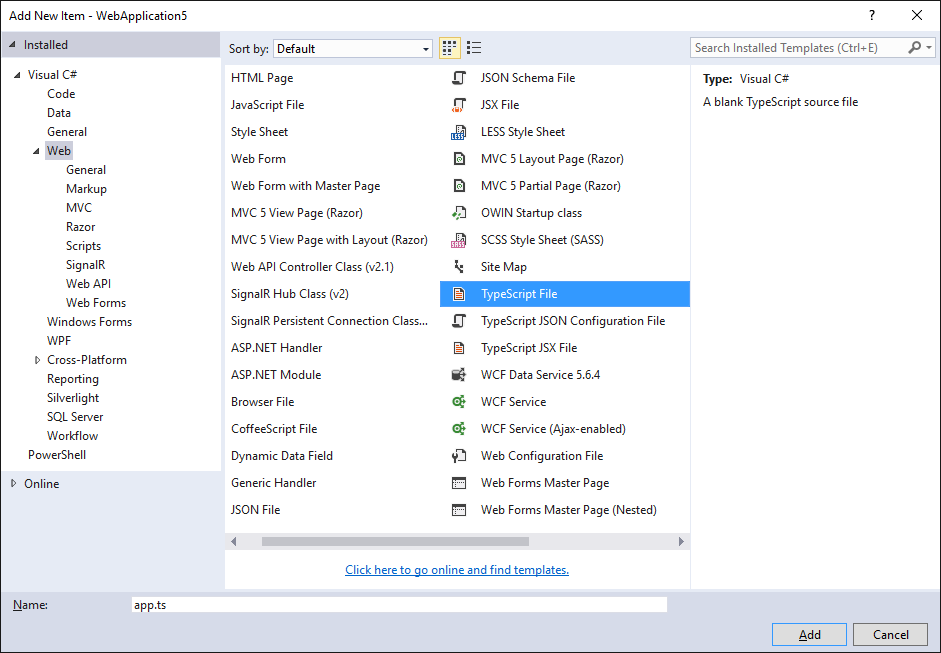

# ASP.NET 4

## Install TypeScript

If your version of Visual Studio does not already have TypeScript, you can install it for [Visual Studio 2015](http://www.microsoft.com/en-us/download/details.aspx?id=48593) or [Visual Studio 2013](https://www.microsoft.com/en-us/download/details.aspx?id=48739).
This quickstart uses Visual Studio 2015.

## Create a new project

1. Choose File
2. Choose New Project (Ctrl + Shift + N)
3. Choose Visual C#
4. Choose ASP.NET Web Application

    

5. Choose MVC

    I unchecked "Host in the cloud" since this will be a local demo.
    

Run the application and make sure that it works.

# Add TypeScript

The next step is to add a folder for TypeScript.


We'll just call it src.


## Add TypeScript code

Right click on `src` and click New Item.
Then choose TypeScript File and name the file `app.ts`.



## Add example code

Type the following code into app.ts.

```ts
function sayHello() {
    const compiler = (document.getElementById("compiler") as HTMLInputElement).value;
    const framework = (document.getElementById("framework") as HTMLInputElement).value;
    return `Hello from ${compiler} and ${framework}!`;
}
```

## Set up the build

Right click on the project and click New Item.
Then choose TypeScript Configuration File and use the default name `tsconfig.json`.


The default `tsconfig.json` should look like this:

```json
{
  "compilerOptions": {
    "noImplicitAny": false,
    "noEmitOnError": true,
    "removeComments": false,
    "sourceMap": true,
    "target": "es5"
  },
  "exclude": [
    "node_modules",
    "wwwroot"
  ]
}
```

We're going to explicitly list the source files in this demo, as well as turn on `"noImplicitAny"`.
noImplicitAny is good idea whenever you're writing new code -- you can make sure that you don't write any untyped code by mistake.
We also need to specify that `"outDir": "./Scripts/App"`:

```json
{
  "compilerOptions": {
    "noImplicitAny": true,
    "noEmitOnError": true,
    "removeComments": false,
    "sourceMap": true,
    "target": "es5",
    "outDir": "./Scripts/App"
  },
  "files": [
    "./src/app.ts",
  ]
}
```

## Call the script from a view

1. In the Solution Explorer, open Views | Home | Index.cshtml.

    

2. Change the code to be the following:

```html
@{
    ViewBag.Title = "Home Page";
}
<script src="~/Scripts/App/app.js"></script>
<div id="message"></div>
<div>
    Compiler: <input id="compiler" value="TypeScript" onkeyup="document.getElementById('message').innerText = sayHello()" /><br />
    Framework: <input id="framework" value="ASP.NET" onkeyup="document.getElementById('message').innerText = sayHello()" />
</div>
```

## Test

1. Run the project.
2. You should see a message when you type in the input boxes:


## Debug

1. In Edge, press F12 and click the Debugger tab.
2. Look in the first localhost folder, then src/app.ts
3. Put a breakpoint on the line with `return`.
4. Type in the boxes and confirm that the breakpoint hits in TypeScript code and that inspection works correctly.


That's all you need to know to include basic TypeScript in your ASP.NET project.
Next we'll include Angular and write a simple Angular app.

# Add Angular 2

## Download packages from NPM

1. Install [PackageInstaller](https://github.com/madskristensen/PackageInstaller).

2. Use PackageInstaller to install Angular 2, systemjs and Typings.

    
    
    

3. Use PackageInstaller to install typings for es6-shim.

    Angular 2 includes es6-shim for Promise support, but TypeScript still needs the types.
    In PackageInstaller, choose Typing instead of npm.
    Then type "es6-shim":

    

## Update tsconfig.json

Now that Angular 2 and its dependencies are installed, we need to enable TypeScript's experimental support for decorators and include the es6-shim typings.
In the future decorators and ES6 will be the default and these settings will not be needed.
Add `"experimentalDecorators": true, "emitDecoratorMetadata": true` to the `"compilerOptions"` section, and add `"./typings/main.d.ts"` to the `"files"` section.
Finally, we need to add a new entry in `"files"` for another file, `"./src/model.ts"`, that we will create.
The tsconfig should now look like this:

```json
{
  "compilerOptions": {
    "noImplicitAny": false,
    "noEmitOnError": true,
    "removeComments": false,
    "sourceMap": true,
    "target": "es5",
    "experimentalDecorators": true,
    "emitDecoratorMetadata": true,
    "outDir": "./Scripts/App"
  },
  "files": [
    "./src/app.ts",
    "./src/model.ts",
    "./typings/main.d.ts"
  ]
}
```

## Add a CopyFiles target to the build

Finally, we need to make sure that the Angular files are copied as part of the build.
To do this, edit the project by right-clicking 'Unload' and then 'Edit csproj'.
After the TypeScript configuration PropertyGroup, add a new ItemGroup and Target to copy the angular files.

```xml
<ItemGroup>
  <NodeLib Include="$(MSBuildProjectDirectory)\node_modules\angular2\bundles\angular2.js"/>
  <NodeLib Include="$(MSBuildProjectDirectory)\node_modules\angular2\bundles\angular2-polyfills.js"/>
  <NodeLib Include="$(MSBuildProjectDirectory)\node_modules\systemjs\dist\system.src.js"/>
  <NodeLib Include="$(MSBuildProjectDirectory)\node_modules\rxjs\bundles\Rx.js"/>
</ItemGroup>
<Target Name="CopyFiles" BeforeTargets="Build">
  <Copy SourceFiles="@(NodeLib)" DestinationFolder="$(MSBuildProjectDirectory)\Scripts"/>
</Target>
```

Now right-click on the project and reload it.
You should now see node_modules in the Solution Explorer.

## Write a simple Angular app in TypeScript

First, change the code in `app.ts` to:

```ts
import {Component} from "angular2/core"
import {bootstrap} from "angular2/platform/browser"
import {MyModel} from "./model"

@Component({
    selector: `my-app`,
    template: `<div>Hello from {{getCompiler()}}</div>`
})
class MyApp {
    model = new MyModel();
    getCompiler() {
        return this.model.compiler;
    }
}

bootstrap(MyApp);
```

Then add another TypeScript file in `src` named `model.ts`:

```ts
export class MyModel {
    compiler = "TypeScript";
}
```

Finally, change the code in `Views/Home/Index.cshtml` to the following:

```html
@{
    ViewBag.Title = "Home Page";
}
<script src="~/Scripts/angular2-polyfills.js"></script>
<script src="~/Scripts/system.src.js"></script>
<script src="~/Scripts/rx.js"></script>
<script src="~/Scripts/angular2.js"></script>
<script>
    System.config({
        packages: {
            '/Scripts/App': {
                format: 'cjs',
                defaultExtension: 'js'
            }
        }
    });
    System.import('/Scripts/App/app').then(null, console.error.bind(console));
</script>
<my-app>Loading...</my-app>
```

This loads the app.
When you run the ASP.NET application you should see a div that says "Loading..." and then updates to say "Hello from TypeScript".
