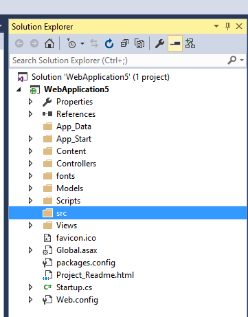

# ASP.NET 4

## Install TypeScript

If your version of Visual Studio does not already have TypeScript, you can install it for [Visual Studio 2015](http://www.microsoft.com/en-us/download/details.aspx?id=48593) or [Visual Studio 2013](https://www.microsoft.com/en-us/download/details.aspx?id=48739).
This quickstart uses Visual Studio 2015.

## Create a new project

1. Choose File
2. Choose New Project (Ctrl + Shift + N)
3. Choose Visual C#
4. Choose ASP.NET Web Application

    

5. Choose MVC
    I unchecked "Host in the cloud" since this will be a local demo.
    

Run the application and make sure that it works.

# ASP.NET 4 with TypeScript

The next step is to add a folder for TypeScript.


We'll just call it src.



## Add TypeScript code

Right click on src and click New Item.
Then choose TypeScript File and name the file app.ts.


## Add example code

Type the following code into app.ts.

```ts
function sayHello() {
    const compiler = (document.getElementById("compiler") as HTMLInputElement).value;
    const framework = (document.getElementById("framework") as HTMLInputElement).value;
    return `Hello from ${compiler} and ${framework}!`;
}
```

## Set up the build

Right-click on the project node and click Properties.
Then choose the TypeScript Build tab.
Check "Redirect JavaScript output to directory" and give the value: `./Scripts/App`.


## Call the script from a view

1. In the Solution Explorer, open Views | Shared | _Layout.cshtml.
    

2. Inside the `<head>` element, add the line:

    ```html
    @Scripts.Render("~/Scripts/App/app.js");
    ```

2. In the Solution Explorer, open Views | Home | Index.cshtml.
    

3. At the top, add the following code after the `@{ ... }`:

```html
<div id="message"></div>
<div>
    Compiler: <input id="compiler" value="TypeScript" onkeyup="document.getElementById('message').innerText = sayHello()" /><br />
    Framework: <input id="framework" value="ASP.NET" onkeyup="document.getElementById('message').innerText = sayHello()" />
</div>
```

## Test

1. Run the project.
2. You should see a message when you type in the input boxes:


## Debug

1. In Edge, press F12 and click the Debugger tab.
2. Look in the first localhost folder, then src/app.ts
3. Put a breakpoint on the line with `return`.
4. Type in the boxes and confirm that the breakpoint hits in TypeScript code and that inspection works correctly.


That's all you need to know to include basic TypeScript in your ASP.NET project.
Next we'll include Angular and write a simple Angular app.

# ASP.NET 4 with TypeScript with Angular

1. Install [PackageInstaller](https://github.com/madskristensen/PackageInstaller).
1. Use PackageInstaller to install Angular.
2. Add angular to project.
3. Add a CopyFiles step to the build.
4. Add TypeScript code for talking to Angular.

# ASP.NET 4 with TypeScript with gulp

# ASP.NET 4 with TypeScript with gulp with browserify

# ASP.NET 4 with TypeScript with gulp with browserify with minify

# ASP.NET 4 with TypeScript with gulp with browserify with minify with Angular

# ASP.NET Core with TypeScript
